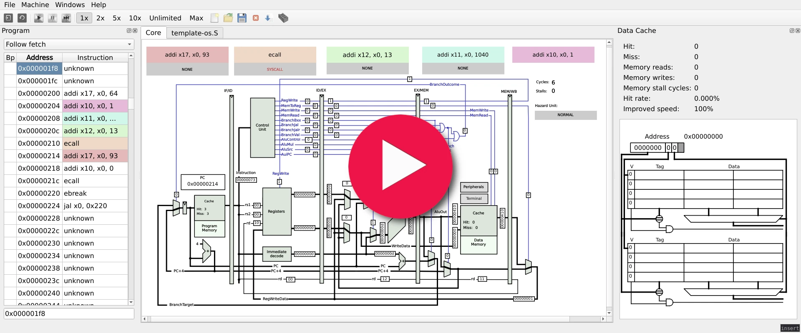

# About Us

This is a joint effort of [Faculty of Electrical Engineering](https://fel.cvut.cz) and [Faculty of Information Technology](https://fit.cvut.cz) to provide open tools and materials for teaching computer architecture principles.

# Simulators

- QtRvSim [Online](https://comparch.edu.cvut.cz/qtrvsim/app), [Source](https://github.com/cvut/qtrvsim), [Download](https://github.com/cvut/qtrvsim/releases)
- QtMips [Online](https://comparch.edu.cvut.cz/qtmips/app), [Source](https://github.com/cvut/QtMips/), [Download](https://github.com/cvut/QtMips/releases)

# Related Courses

- [FEL: B35APO Computer Architectures](/courses/fel/b35apo/)
- [FIT: BI-APS Architectures of Computer Systems](/courses/fit/bi-aps/)
- [FEL: B4M35PAP Advanced Computer Architectures](/courses/fel/b4m35pap/)

# Online Tools and Training

- [WebEvaluator for QtRvSim](/online-tools/webeval/) ([direct link](https://eval.comparch.edu.cvut.cz) to the web interface)

# Presentations

- FOSDEM 2023 [QtRVSim—Education from Assembly to Pipeline, Cache Performance, and C Level Programming](https://fosdem.org/2023/schedule/event/rv_qtrvsim/) in Brussels, [Slides](https://fosdem.org/2023/schedule/event/rv_qtrvsim/attachments/slides/5732/export/events/attachments/rv_qtrvsim/slides/5732/qtrvsim_fosdem23_slides.pdf) 
- [QtRvSim – RISC-V Simulator for Computer Architectures Classes](https://comparch.edu.cvut.cz/slides/ewc22-qtrvsim.pdf) @ [Embedded World Conference 2022](https://events.weka-fachmedien.de/embedded-world-conference/program/)

- [QtRvSim](https://github.com/cvut/qtrvsim) has been presented by Jakub Dupák at RedHat organized [DevConf.cz mini](https://www.devconf.info/cz/) in Brno, [Video](https://youtu.be/l0jfvINWgK4), [Slides](https://github.com/devconfcz/archive/blob/main/2022/November/DevConfCZMini/devconf-qtrvsim.pdf)
- RISC-V International Academic and Training SIG: [QtRvSim - RISC-V Simulator with Cache and Pipeline Visualization (YouTube)](https://youtu.be/J6AcPZZ_ISg?t=12)

# Publications

- Dupák, J.; Píša, P.; Štepanovský, M.; Kočí, K. **QtRVSim – RISC-V Simulator for Computer Architectures Classes** In: embedded world Conference 2022. Haar: WEKA FACHMEDIEN GmbH, 2022. p. 775-778. ISBN 978-3-645-50194-1.
  - [Available online](/publications/ewC2022-Dupak-Pisa-Stepanovsky-QtRvSim.pdf)

Please reference above article, if you use QtRvSim in education or research related materials and publications.
